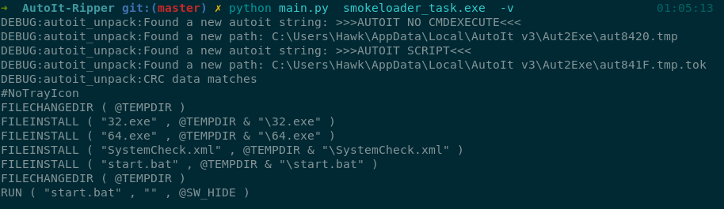

# AutoIt-Ripper

## What is this
This is a (semi) short python script that allows for extraction of "compiled" AutoIt scripts from PE executables.

## References
This script is **heavily** based on ~~2~~ 3 resources, definitely check them out if you want to dig a bit deeper into the whole AutoIt stuff:
 * http://files.planet-dl.org/Cw2k/MyAutToExe/index.html
   * [Github mirror I](https://github.com/dzzie/myaut_contrib)
   * [Github mirror II](https://github.com/PonyPC/myaut_contrib)
 * https://github.com/sujuhu/autoit
 * https://opensource.apple.com/source/clamav/clamav-158/clamav.Bin/clamav-0.98/libclamav/autoit.c.auto.html

## Supported AutoIt versions

### Ready:

* `EA05` AutoIt3.00
* `EA06` AutoIt3.26+

### Unknown:

* `JB01` AutoHotKey
* `JB01` AutoIT2

## Installation
```bash
python3 -m pip install -r requirements.txt
```

## Running
```bash
python3 main.py input.exe
```

Optionally specify target AutoIt version with `--ea EA05` or `--ea EA06` for v3.00 and v3.26 respectively.





## Format documentation
#### (In progress)


### AU3 header

|       Field      |    Length     | encryption (EA05) | encryption (EA06) |            Notes            |
|:----------------:|:-------------:|:-----------------:|:-----------------:|:---------------------------:|
|      "FILE"      |       4       |  MT(0x16FA)       |  LAME(0x18EE)     |        static string        |
|       flag       |       4       |  xor(0x29BC)      |  xor(0xADBC)      |                             |
|     auto_str     |   flag (* 2)  |  MT(0xA25E + flag)|LAME(0xB33F + flag)|        UTF-8/UTF-16         |
|     path_len     |       4       |  xor(0x29AC)      |  xor(0xF820)      |                             |
|       path       | path_len (* 2)|MT(0xF25E + path_len)|LAME(0xF479 + path_len) | Path of the compiled script |
|    compressed    |       1       |  None             |  None             |   is the script compressed  |
|     data_size    |       4       |  xor(0x45AA)      |  xor(0x87BC)      |    compressed data size     |
|     code_size    |       4       |  xor(0x45AA)      |  xor(0x87BC)      |    uncompressed data size   |
|       crc        |       4       |  xor(0xC3D2)      |  xor(0xA685)      | compressed data crc checksum|
|   creation date  |       4       |  None             |  None             |  file creation date (high)  |
|   creation date  |       4       |  None             |  None             |  file creation date (low)   |
| last update date |       4       |  None             |  None             |      last edit date (high)  |
| last update date |       4       |  None             |  None             |       last edit date (low)  |
|       data       |   data_size   |MT(checksum + 0x22af)|LAME(0x2477)     |         script data         |

### Differences between v3.00 and v3.26+

|                     	| v3.00              	| v3.26                                 	|
|---------------------	|--------------------	|---------------------------------------	|
| Code storage        	| greped by magic    	| "SCRIPT" resource (/greped by magic?) 	|
| String encoding     	| UTF-8             	| UTF-16                                	|
| Encryption          	| xor/custom MT19937 	| xor/LAME crypt                        	|
| Code encryption key 	| dynamic            	| static                                	|
| Compression         	| yes                	| yes                                   	|
| Code "compilation"  	| no                 	| yes                                   	|
| Magic               	| EA05               	| EA06                                  	|
